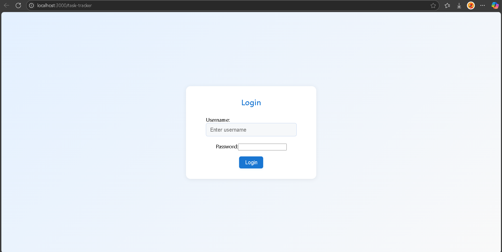
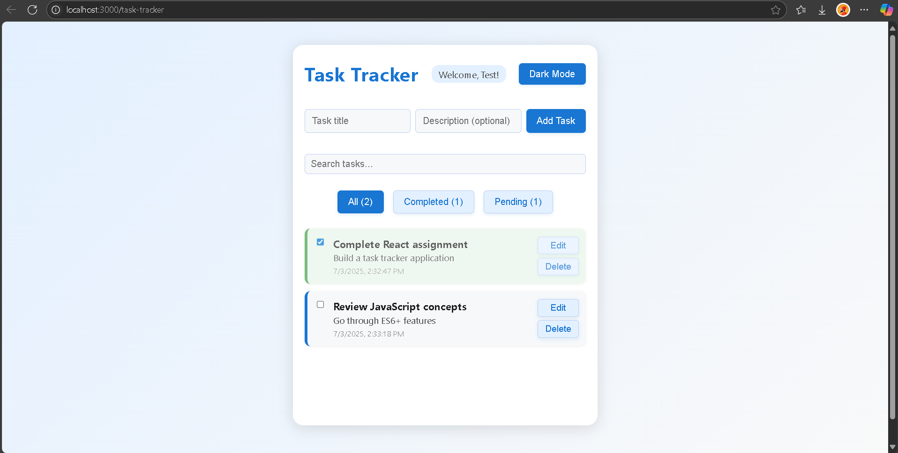

# Personal Task Tracker

## Description

A simple, user-friendly personal task management app built with React. Add, edit, delete, and filter your tasks. All data is stored in your browser for privacy and persistence.

## Features

- Simple login (username only, stored in browser)
- Add, edit, and delete tasks
- Mark tasks as completed or pending
- Filter tasks (All, Completed, Pending)
- Search tasks by title or description
- Responsive design (mobile & desktop)
- Dark mode toggle
- Data persists in browser (localStorage)

## Setup Instructions

1. Clone the repository
2. Run `npm install`
3. Run `npm start`
4. Open [http://localhost:3000](http://localhost:3000) in your browser

## Technologies Used

- React.js

## Live Demo

[Click to see the live Demo](https://personal-task-tracker-zeta.vercel.app/)

## Screenshots

  

